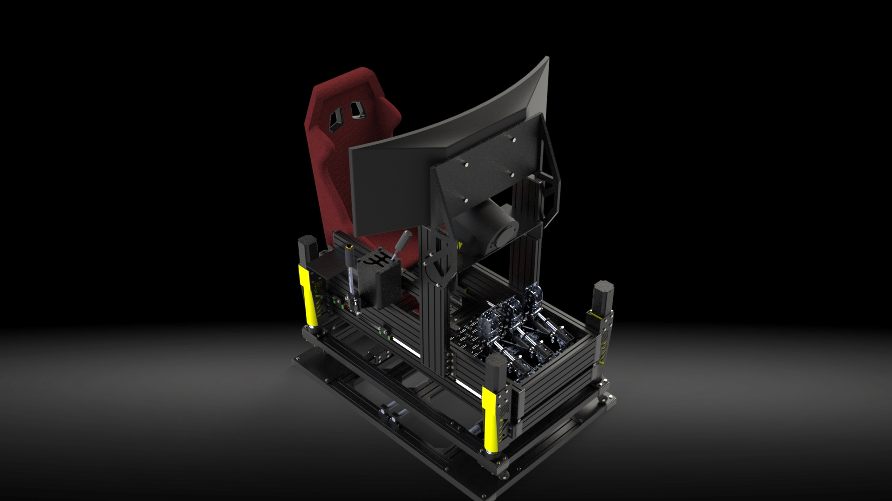
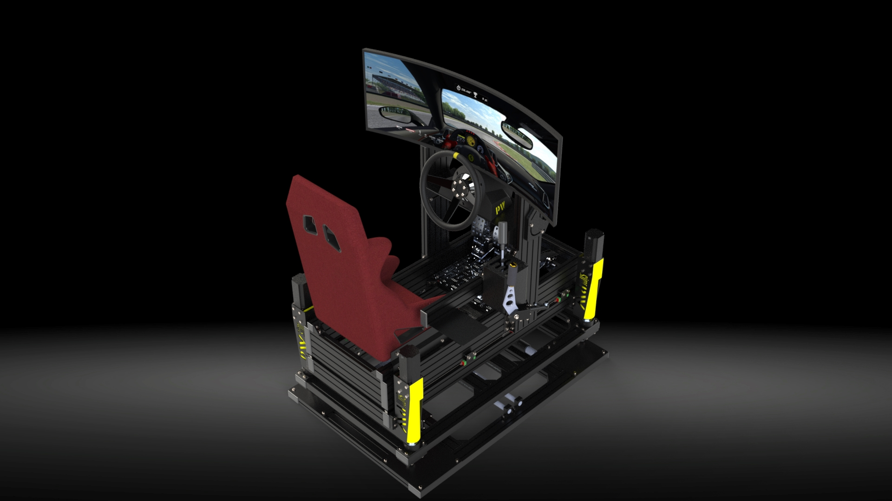
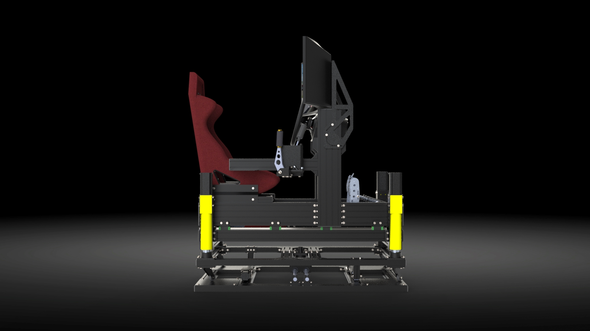
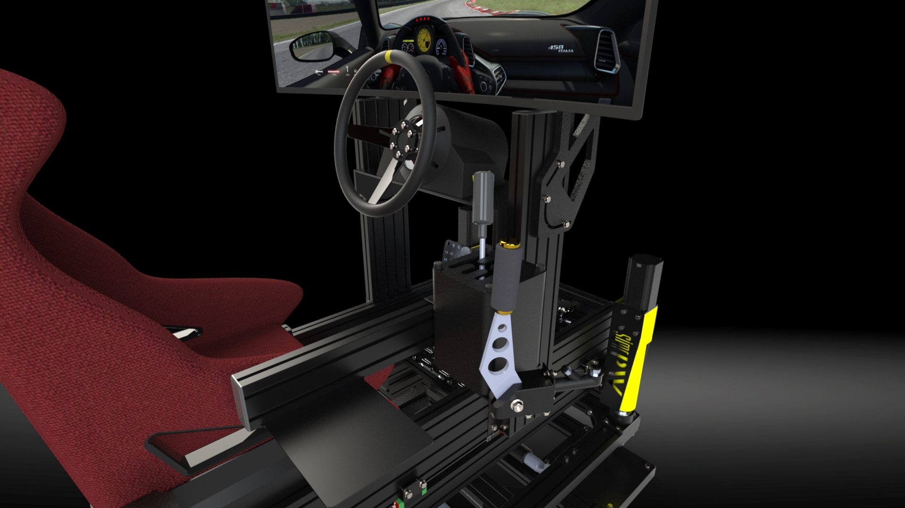
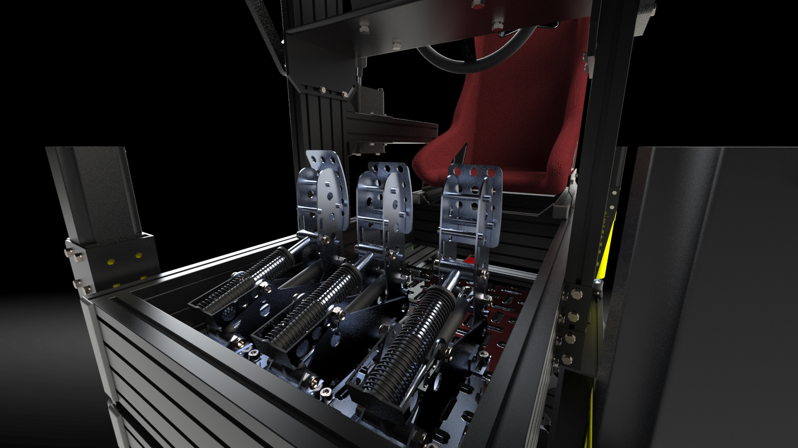

# Driving Simulator Solidworks Project Developed for DPS Software Students Competition in 2022

## Table of Contents
- [Overview](#overview)
- [Features](#features)
- [Project Structure](#project-structure)
- [Renders](#renders)

## Overview

This Driving Simulator is a project designed to provide a realistic driving experience by utilizing multiple actuators. The goal is to simulate various driving scenarios, such as loss of traction or car's behavior on impact and actual suspension response, offering users a dynamic and immersive environment.

## Features

- 4 actuators for realistic suspension simulation.
- Impact simulating actuator
- Pair of actuators imitating traction loss
- Ultra wide curved monitor providing high visibility and realistic experience
- High quality components including steering wheel with Force Feedback, gearbox stick and pedals 

## Project Structure

The project is organized into the following directories:

- `Actuators`: Contains the SolidWorks files for the actuators used in the simulator.
- `Bracket Connectors`: Contains the SolidWorks files for various brackets and connectors connecting individual parts of the project.
- `Platforms`: Project is made of 4 platforms, this directory contains SolidWorks files for all of these.
- `Renders`: Contains .jpg files of project renders.

## Renders

**Author:**
Mateusz Klisiewicz
mmateuszklisiewicz@gmail.com
